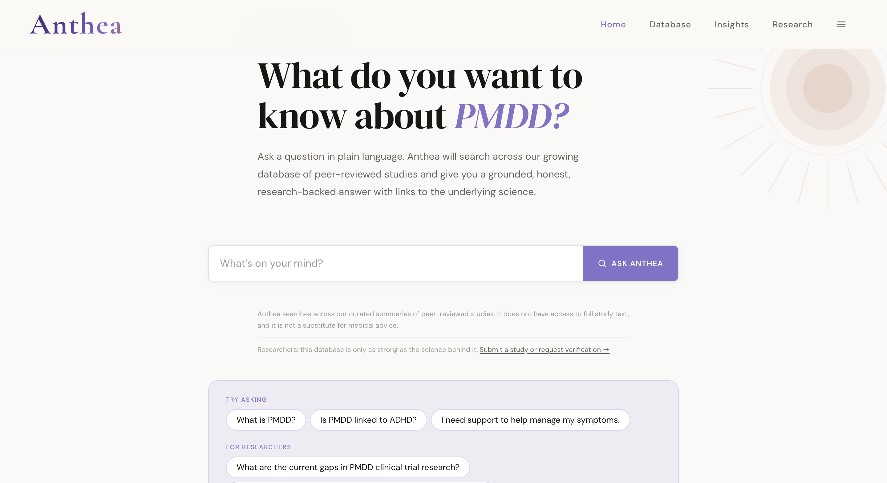
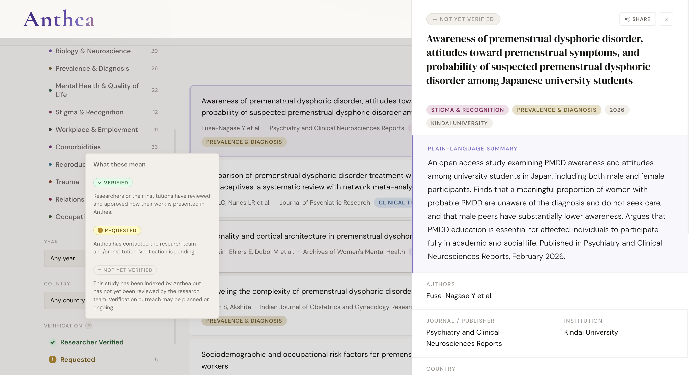
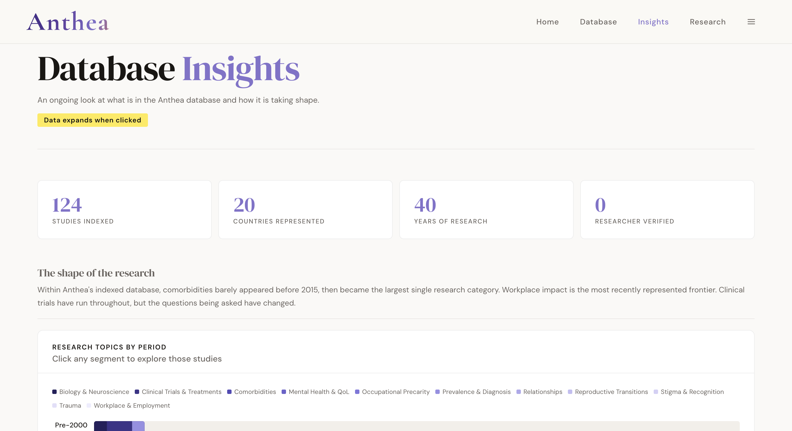

# anthea

Anthea is a passion project inspired by lived experience in my family and by my work with the Crisis Text Line over the course of the past year. 

It is a platform connecting people touched by PMDD through curated peer-reviewed research, plain-language access, and tools for participation and trust.

---
 

--- 

 

---

 

## Stack

- **Frontend**: Single-file HTML/CSS/JS. No build step, no framework
- **Backend**: Supabase (Postgres) — study database and researcher records
- **AI layer**: Anthropic Claude via proxied Netlify Function
- **Hosting**: Netlify (auto-deploy from GitHub)
- **Email**: Google Workspace

---

## Features

- Indexed database of peer-reviewed PMDD studies with structured metadata
- `Ask Anthea` — an AI research query tool scoped to indexed studies, with
  distress-aware safety routing
- Insights page with aggregate stats across the corpus
- Researcher verification system
- Pre-computed corpus context injected into every query at runtime

---

## Architecture notes

**AI scoping**: `Ask Anthea` does not draw on general model knowledge. Every
answer is scoped to Anthea's indexed studies. This is a deliberate trust
decision.

**Safety routing**: Distress detection runs before all other routing logic.
Emotionally distressed queries receive a care response regardless of whether
they contain clinical vocabulary. Full routing order: crisis → gibberish →
off-topic (bypassed on distress) → provider guidance → research answer.

**Rate limiting**: In-memory per Netlify function instance. Upstash Redis
migration planned before public launch.

**Netlify Function proxy**: The Anthropic API key is never exposed to the
client. All AI requests route through a proxied Netlify function.

---

## Status

Live. Closed beta. Solo project.
